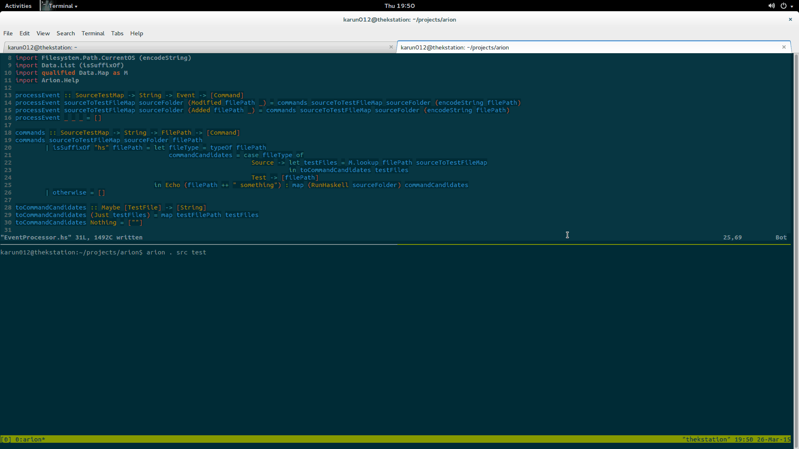

# Arion 

[![Build Status][badge-travis]][travis]
[![Available on Hackage][badge-hackage]][hackage]
![Hackage Dependencies][badge-hackage-deps]

[badge-travis]: https://travis-ci.org/karun012/arion.png
[travis]: https://travis-ci.org/karun012/arion
[badge-hackage]: http://img.shields.io/hackage/v/arion.svg
[hackage]: https://hackage.haskell.org/package/arion
[badge-hackage-deps]:https://img.shields.io/hackage-deps/v/arion.svg


> Homer said in Iliad

> ...there is no man that shall catch thee by a burst of speed, neither pass thee by,
> nay, not though in pursuit he were driving goodly Arion,
> the swift horse of Adrastus, that was of heavenly stock...
> Homer


**Arion helps you make red-green-refactor quick and efficient when working with hspec tests**

**It watches the file system for change in source or test code and selectively runs hspec tests by creating an association between source and test files**


# Usage

```cabal
cabal update
cabal install arion
arion <folder-to-watch> <folder with source files> <folder with test files>
  or
arion --help
```

# Demo

